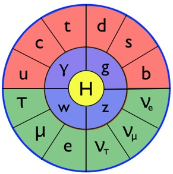

### Particle Zoo

For much of the first half of the twentieth century, physicists believed there were just three fundamental particles: the familiar proton, neutron, and electron. By the mid 1960s, however, that picture had changed. Improvements to particle accelerator and detector technology had given way to the discovery of a seemingly endless list of new particles. Simplicity, elegance - these are hallmarks of a good scientific theory, and these were definitively lacking from the so called ‘[particle zoo](http://www.particlezoo.net)’ of the day. Scientists began to look for a more simple, unified theory to explain these particles on a fundamental level.

### Elegant, but Incomplete

Over the course of the next several decades, a theory that became known as the [Standard Model of Particle Physics](https://en.wikipedia.org/wiki/Standard_Model) emerged. Now one of the most well supported scientific theories in history, this model does explain the fundamental structure behind the ‘particle zoo’ with incredible accuracy. 
<figure>

<figcaption> The particles of the Standard Model: fermions in red (quarks) and green (leptons), vector bosons in blue and the Higgs boson in yellow.</figcaption>
</figure>
The theory describes two fundamental types of particles: fermions, which makes up all of the ‘stuff’ around us, and bosons, which mediate how fermions interact with one another. Two familiar examples are the electron (a fermion) and a photon (a boson), the particle of light which carries the electromagnetic force. Fermions are further divided into quarks - which make up protons and neutrons - and leptons - which include electrons in addition to muons, taus, and the elusive, barely-massive neutrinos.

The Standard Model predicts the properties of particles with incredible precision, and for a while, it truly seemed to be the fundamental theory that physicists of the ‘particle zoo’ days sought so ardently. Yet, there remained one major problem - the theory could not explain why any particle has mass, much less predict the masses of individual particles. 

### The Higgs and Beyond

To solve this problem, Peter Higgs, François Englert and others [theorized an extension to the Standard Model](http://physics.aps.org/articles/v6/111). They predicted the existence of a fundamental field that exists everywhere, all of the time and gives mass to fundamental particles. Further, they predicted that an excitation of this field could be observed as a particle - the famed Higgs Boson. In July of 2012, nearly fifty years after the Higgs boson was first theorized, [CERN confirmed](http://home.web.cern.ch/topics/higgs-boson) that the elusive particle had been observed by both the CMS and Atlas experiments.

This initial observation of the Higgs lead to almost as many questions as answers. Physicists have learned relatively little about the boson’s properties from experimental data - more data must be taken to confirm to what extent the observed particle matches the predicted one.  And, despite it’s successes, the Standard Model has some deficiencies.  It cannot account for most of the mass in the universe, which is bound up in so-called Dark Matter.  Nor can it explain why the universe is dominated by matter and not made of equal parts matter and anti-matter.  And don’t even think about including gravity in the picture!  Clearly, there are many questions to explore about the universe and sub atomic particles. 

### Further Reading

To learn more about the Standard Model of particle physics we suggest the following sources:

* [The Particle Adventure](http://www.particleadventure.org) for a fun and interactive exploration of the world of subatomic particles.
* [Professor Matt Strassler's Blog](http://profmattstrassler.com/new-start-here/) about particle physics.
* The movie [Particle Fever](http://particlefever.com)!
