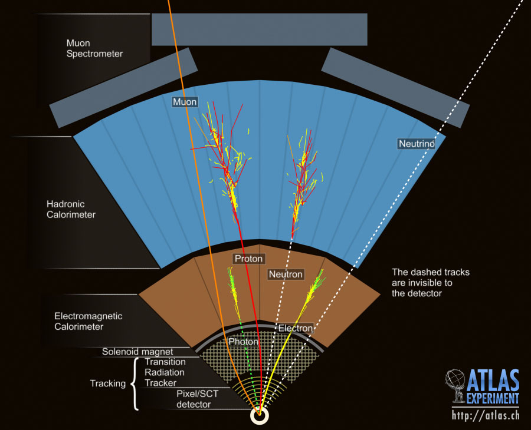

### LHC and Particle Collision

Particle physics takes the simplest possible approach to studying the most fundamental pieces of our universe: smashing things together and seeing what happens. The [Large Hadron Collider (LHC)](http://home.web.cern.ch/topics/large-hadron-collider), an enormous circular tube of 27km circumference filled with superconducting magnets cooled with superfluid helium, was constructed by an international collaboration of scientists and engineers solely to make infinitesimally small particles move spectacularly quickly and collide with each other. Circular [particle accelerators](http://home.web.cern.ch/about/how-accelerator-works) consist of [radio frequency](https://en.wikipedia.org/wiki/Radio_frequency) cavities that accelerate charged particles and magnets which maintain the circular orbit of these particles. A particle’s speed dramatically increases as it revolves inside the tube. For example, a proton in the LHC can be accelerated to 0.999999991 times the speed of light. This is only 3 meters per second slower than the speed of light! Then scientists shoot bunches of these fast particles into each other. When they collide, interesting things can happen.

<figure>

<figcaption> An ATLAS event display containing two b-jets and missing energy</figcaption>
</figure>
In most proton collisions the quarks and gluons inside the two protons interact to form a wide array of low-energy, ordinary particles. Occasionally, heavier particles are produced, or energetic particles paired with their anti-particles.  Very occasionally, these collisions produce new particles for us to find. Through this process of colling particles, scientists discovered [top-quarks](http://www.fnal.gov/pub/science/historical-results/), [bottom](http://history.fnal.gov/botqrk.html) and [charm](http://www.symmetrymagazine.org/article/may-2009/august-2008-explain-it-in-60-seconds-charm-quark)-quarks, and the [W & Z bosons](http://cern-discoveries.web.cern.ch/cern-discoveries/courier/heavylight/heavylight.html). Acceleration is necessary because the faster the particles are, the higher energy they obtain, opening up the possibility to produce previously unknown phenomena. Most recently, the Higgs boson, which holds the secret of the origin of mass, [was discovered](http://www.smithsonianmag.com/science-nature/how-the-higgs-boson-was-found-4723520/?no-ist) at the LHC. 
  
The goal of colliding particles is to answer questions such as what is all matter made of, and what creates the interactions of matter, in the most fundamental level. By discovering new particles and phenomenon we can find answers to these questions.

### ATLAS and Particle Detection
<figure>

<figcaption> The ATLAS experiment under construction circa 2005. </figcaption>
</figure>

After the collision of two protons, experiments such as ATLAS try to measure all of the particles which are produced and reconstruct what was created in the initial interaction.  Massive detectors containing millions of electonic channels are needed to accurately measure all of the collision debris.  The ATLAS experiement consists of an inner detector comprised of silicon [pixel](http://www.quantumdiaries.org/2008/07/25/how-a-pixel-detector-works/) and [strip](http://cms.web.cern.ch/news/silicon-strips) detectors which measure the trajectories of charged particles, [calorimeters](http://www.atlas.ch/calorimeter.html), which measure the energies of hadrons, electrons and photons, and, finally, [muon detectors](https://www.youtube.com/watch?v=Z39BFx3nvKQ), which measure the trajectories of muons.  Neutrinos, which don't interact with the detector, are inferred by the [imbalance](http://www.quantumdiaries.org/2009/07/10/whats-missing-energy/) in the direction of the total energy flow of the event. 

By analyzing the trajectories and energies of the particle, we can calculate the dynamics of the collision and search for new particles. After repeating thousands of collisions, a statistically significant result can be obtained about the existence of a new particle. This is how the Higgs particle was discovered in ATLAS in 2013. 

### More Information

We suggest checking out:

* Exploring Peter McCready's [interactive panorama](http://www.petermccready.com) of the LHC and its experiments
* CERN's [YouTube Channel](https://www.youtube.com/user/CERNTV)
* The ATLAS experiment's [public webpage](http://www.atlas.ch).  