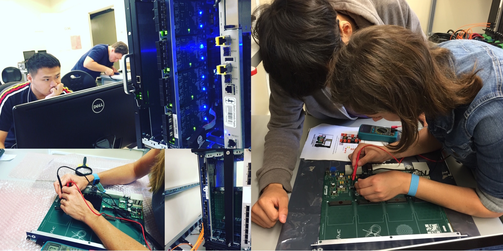

As the LHC reaches new energy and intensity extremes during its [13 TeV run](http://www.symmetrymagazine.org/article/february-2015/whats-new-for-lhc-run-ii), we face new challenges.  Before 2015, the LHC collided bunches of protons every 50 nanoseconds, with an average of 20 simultaneous individual proton-proton interactions per bunch collision (or bunch-crossing).  For the data taking in 2015 and beyond, bunches will collide every 25 nanosecond with up to 80 simultaneous proton-proton interactions.  The rate of data at these intensities is too high for the experiment to record all of it, so we use a multi-step, fast decision making process to decide which data to keep and which to discard.  This process is implemented in the [trigger system](http://www.atlas.ch/trigger.html).  Higgs bosons are produced 10 billion times less frequently than ordinary proton collisions, so the task of the trigger system is to keep the Higgs bosons and other interesting particles, and throw away the ordinary collisions.

The first stage of the trigger system is implemented in custom hardware and reduces the data rate by a factor of 1/400. Several further software-based processing steps reduce the rate by an additional factor of 100, which is low enough for us to keep.  These decisions have to be made quickly, which becomes more challenging as the LHC intensity increases.  [FTK - or Fast TracKer -](http://www.atlas.ch/trigger.html) is a hardware system that helps to combat these challenges by adding additional information to the decision making process.  It very quickly reconstructs the charged particle trajectories from the pixel & silicon detectors and makes these "tracks" available to the algorithms in the software based processing step.  Without FTK, only a very limited subset of the pixel & silicon detector can be used because it takes too much software processing power to make sense of it.  

An important example of this data-identification is the FTK’s ability to identify [b-jets](http://www.quantumdiaries.org/2011/05/12/to-b-or-not-to-bbar-b-jet-identification/), which are the signature of one of the heaviest fundamental particles: the bottom quark. They originate in Higgs boson decays, and in many theories beyond the Standard Model.  b-jets are distinguished by ordinary jets by their charged particle content, so FTK will make their identification more efficient by incorporating more charged particle trajectories.

<figure>

</figure>

The FTK system is comprised of several sub-systems with unique functions. The Data Formatter (DF) in takes data and arranges it into conical regions for the Processing Units (Proc. unit).  The charged particle pattern recognition and determination of the particle's trajectories is performed using custom associative memories (AM), the track fitters (TF), and second stage fit.  The additional components in the system organize the information for fast retrieval (DO), remove any duplication in the processing (HW) and format the data for the software-based triggering algorithms (FLIC).  

At Stanford we are responsible for the production, testing, installation and operation of the Data Formatter system. We completed production and testing in September 2015 and are moving on to installation in the fall of 2015.  The boards were designed by Fermilab's [ATCA@FNAL project](http://www-ppd.fnal.gov/EEDOffice-w/Projects/ATCA/).

<figure>

<figcaption>Rex, Zihao, Lauren, Mingyu and Grace testing Data Formatter boards.   </figcaption>
</figure>